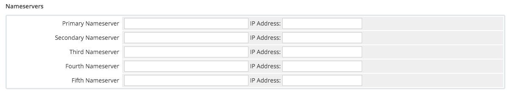
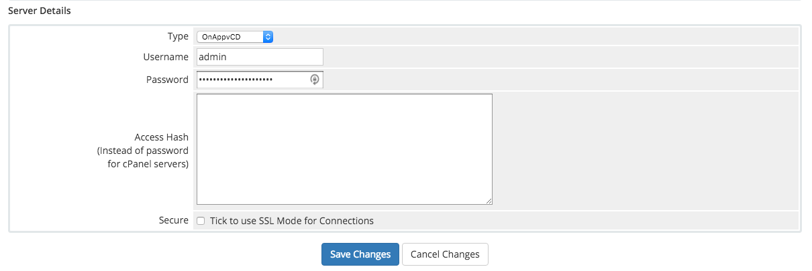
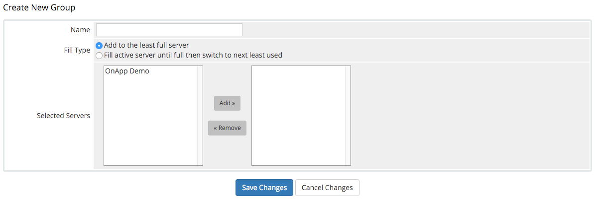
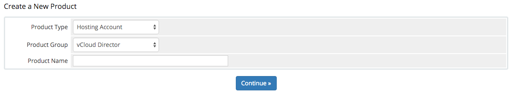
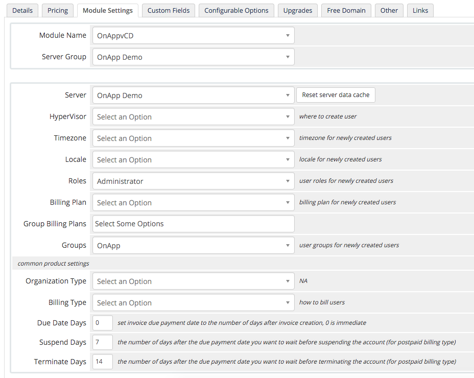

# WHMCS Module for OnApp with vCD


>Before installing the WHMCS Module for OnApp with vCloud Director, please ensure that you meet the following requirements:
>
> * WHMCS 6.2+ [[Requirements](http://docs.whmcs.com/System_Requirements)] [[Installation](http://docs.whmcs.com/Installing_WHMCS)]
> * OnApp 4.2+ with vCloud Director Integration

## Installation

1. Define the correct timezone in your PHP settings:

	```date.timezone = {desired timezone}```

	For Example:

	```date.timezone = Europe/London```

2. Download the latest version of the [OnApp PHP Wrapper](https://github.com/OnApp/OnApp-PHP-Wrapper-External/archive/4.2.0.zip)

3. Extract the files so they are located in the following directory:
	
4. Download the latest version of the [WHMCS Module](https://github.com/OnApp/WHMCS-vCD/archive/master.zip)

5. Extract and upload into the root WHMCS directory.

## Configuration

After installing the WHMCS module, the next step is to make sure that WHMCS is properly configured - that you have configured general system settings, activated payment methods, and set up at least one product group.

### Adding a Server

1. Log in to your WHMCS Admin Area.

2. Go to Setup >Product/Services> Servers.

3. On the page that loads, click Add New Server link.

4. Fill in the form that appears:
	
	
	
	You only need to fill in the fields mentioned here, with a brief description of them:
	
	> **Name** – the optional OnApp server name.
	
	> **Hostname** – the hostname of the server you're adding. If you connect to the server using secure connection, fill in this field using an https:// prefix.
	
	> **IP Address** – the IP address of the OnApp server. 
	
	> **Enable/disable** – tick the box to disable the server.
	
5.	You can leave the following form blank:

	
	
6. Specify the server details of your OnApp Installation:

	
	
	Fill in the following fields:
	
	> **Type** – Select "OnAppvCD" from the dropdown box.
	
	> **Username** – Please use the default 'admin' login for OnApp.

	> **Password** – The password for the specified username.
	
	> **Secure** – tick to use SSL for connections.
	
7. Click "Save Changes" to add the server to WHMCS.

### Creating a Server Group

1. Log in to your WHMCS Admin Area.

2. Go to Setup > Product/Services > Servers.

3. On the page that loads, click Create New Group link.

4. Fill in the form that appears:

	
  > **Name** - Give a name to a server group.
  
  > **Selected Servers** - Specify the server that you created previously to add to the server group.

5. Click "Save Changes" to add the new server group to WHMCS.

### Creating a Product Group

1. Go to Setup > Products/Services > Products/Services in your WHMCS Control Panel.

2. Click the "Create a New Group" link.

3. Fill in the form that appears.

	
	
4. Click Create Group button.

### Creating a Product

When you create a product based on the OnApp vCloud Director WHMCS Module, you connect WHMCS to your OnApp Server and specify the type of service you want to offer. With our current module, you can choose one of the following provisioning models to choose from:

* **Single Organization** - This is where you select a single organization and during sign up, WHMCS deploys a low-level (eg, vApp Author) user where they have access to shared resources within a pre-created virtual data center.
* **Multiple Organization** - This is where during sign up, WHMCS will deploy a new Organization and a new Organization Administrator user where the end user can deploy new virtual data centers from your pre-created vCloud Orchestration models.

Each product must be assigned to a group which can either be visible or hidden from the order page (products may also be hidden individually).

1. Go to Setup > Products/Services > Products/Services in your WHMCS Control Panel.

2. Click the "Create a New Product" link and fill in the form that appears.

	
	
	> **Product Type** - Choose the type of Product, for this module we recommend selecting "Other".
	
	> **Product Group** - Select the name of the Product Group that you had created previously.
	
	> **Product Name** - Specify the desired product name.
	
3. Click "Continue".

4. Complete the forms in the "Details" and "Pricing" tabs. For instructions, refer to the [WHMCS documentation](http://docs.whmcs.com/).

5. Go to the "Module Settings" tab and select "OnAppvCD" from the drop-down menu. 

6. Select the Server Group that you had created previously and click "Save Changes".

7. Select the appropiate OnApp server that you had created previously from the "Server" drop-down menu.

8. Complete the following form with the details of your product.

	
	
	> **Hypervisor** - Select the name of the Compute Resource that links to your vCloud Director instance within OnApp.
	
	> **Timezone** - This will be the timezone that will be selected for all newly created users.
	
	> **Locale** - This will be the locale that will be selected for all newly created users.
	
	> **Roles** - Depending on the "Organization Type" you will select, this should be "vCloud vApp Author" for the "Single Organization" model and "vCloud Organization Administrator" for the "Multiple Organization" model.
	
	> **Billing Plan** - This will be the billing plan assigned to all newly created users. If you are using the "Single Organization" model, then you should ensure that the Organization you select in the "Groups" drop-down has access to this billing plan.
	
	> **Group Billing Plans (Only shown for Multiple Organization model)** - Select the billing plans that the created organization will have access to.
	
	> **Groups (Only shown for Single Organization model)** - Select the Organization that all newly created users will be provisioned in.
	
	> **Organization Type** - Select whether you want to use the Single or Multiple Organization model.
	
	> **Billing Type** - Whether you want to use a post-paid or pre-paid model of billing.
	
9. Save Changes.

Now that the product has been created, you will be able to see it on the order form and setup customers using WHMCS.
